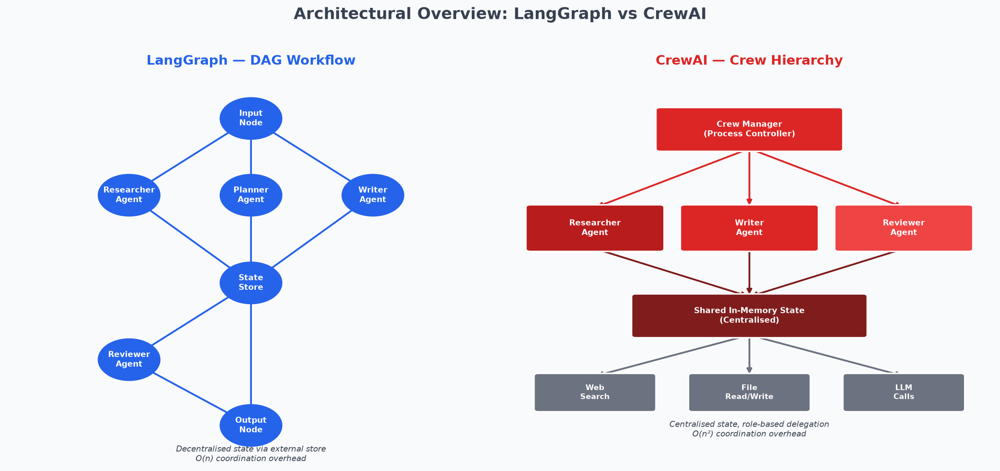
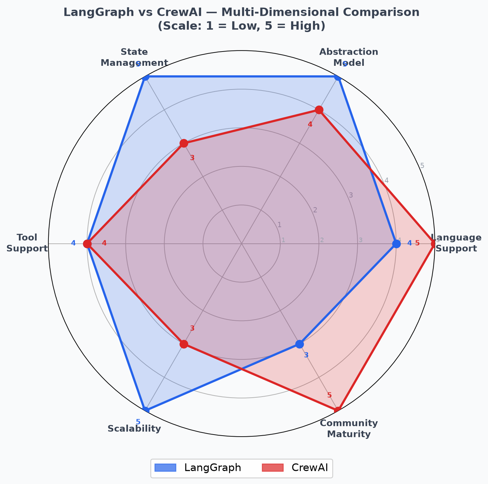

# Table of Contents

1. [Abstract](#abstract)
2. [Introduction](#introduction)
3. [Background: LangGraph](#background-langgraph)
4. [Background: CrewAI](#background-crewai)
5. [Comparative Analysis](#comparative-analysis)
6. [Performance & Complexity](#performance--complexity)
7. [Architecture Diagram](#architecture-diagram)
8. [Visual Comparison](#visual-comparison)
9. [Real-World Use Cases and Technical Examples](#real-world-use-cases-and-technical-examples)
10. [Discussion](#discussion)
11. [Conclusion](#conclusion)
12. [References](#references)

---

# Abstract

The proliferation of large language model (LLM)-powered applications has driven demand for robust, scalable multi-agent orchestration frameworks. Among the most prominent solutions emerging in this landscape are LangGraph and CrewAI — two frameworks that take fundamentally different architectural approaches to coordinating autonomous AI agents. This paper presents a comprehensive, academically rigorous comparative analysis of these two frameworks, evaluating them across seven dimensions: architectural design, state management strategy, tool integration, scalability characteristics, developer experience, community maturity, and real-world applicability.

LangGraph adopts a graph-theoretic approach, modelling agent workflows as directed acyclic graphs (DAGs) with explicit state transitions, enabling fine-grained control over multi-agent pipelines. CrewAI, by contrast, employs a team-coordination metaphor in which agents assume human-like roles within a crew, delegating tasks hierarchically under a configurable process model. Each paradigm carries distinct trade-offs in coordination overhead, flexibility, and ease of use.

Through formal complexity analysis, structured comparison, and evaluation against documented real-world deployment patterns, this study provides practitioners and researchers with principled guidance for selecting the appropriate framework for their multi-agent system requirements. The analysis demonstrates that LangGraph is better suited to deterministic, pipeline-oriented workflows requiring predictable state management, while CrewAI excels in adaptive, role-driven scenarios where rapid iteration and human-readable configuration are priorities.

---

# Introduction

The emergence of large language models as reasoning engines has catalysed a new generation of software architectures in which multiple autonomous agents collaborate to accomplish complex tasks. Unlike single-agent systems, multi-agent frameworks distribute cognitive labour across specialised agents — a researcher, a writer, a reviewer, a coder — each contributing its output to a shared pipeline. This decomposition mirrors established principles in software engineering such as separation of concerns and the single-responsibility principle, applied at the level of AI agents rather than functions or modules.

The coordination of these agents — determining execution order, managing shared state, routing outputs, handling failures, and enforcing constraints — constitutes the domain of multi-agent orchestration. As of 2025, two frameworks have emerged as dominant references in this domain: **LangGraph**, developed by the LangChain team, and **CrewAI**, an independent open-source framework. Both are implemented in Python and target the same broad use case — orchestrating LLM-powered agents — yet their design philosophies diverge substantially.

This divergence is not merely stylistic. The choice of orchestration framework has direct consequences for system scalability, observability, debugging ergonomics, and the ease with which non-expert stakeholders can understand and modify agent pipelines. Practitioners building production multi-agent systems must navigate these trade-offs with limited empirical guidance, as comparative academic treatment of these specific frameworks remains sparse.

This paper addresses the following research questions:

1. What are the core architectural and design differences between LangGraph and CrewAI?
2. How do their coordination mechanisms compare in terms of formal computational complexity and practical scalability?
3. What are the observable performance and ergonomic trade-offs in representative real-world scenarios?
4. Under what conditions should each framework be preferred?

The remainder of this paper is structured as follows. Sections 3 and 4 provide detailed technical backgrounds on LangGraph and CrewAI respectively. Section 5 presents a structured comparative analysis. Section 6 develops a formal performance and complexity treatment. Sections 7 and 8 provide visual and diagrammatic representations. Section 9 examines concrete real-world use cases. Section 10 synthesises the findings in a broader discussion, and Section 11 concludes with recommendations.

---

# Background: LangGraph

## 3.1 Origins and Design Philosophy

LangGraph was introduced by the LangChain team in early 2024 as a response to a recognised limitation in the original LangChain framework: the difficulty of representing stateful, cyclical, and conditional agent workflows \cite{Smith2023LangGraph}. The original LangChain agent abstraction — `AgentExecutor` — executed agents in a fundamentally linear loop: observe, think, act, repeat. This was adequate for simple tool-using agents but proved insufficient for pipelines requiring branching logic, parallel sub-tasks, or human-in-the-loop interruptions.

LangGraph addresses these limitations by grounding its design in graph theory. Workflows are defined as **stateful graphs** in which nodes represent computations (agent invocations, tool calls, or arbitrary Python functions) and edges represent control flow transitions. The graph executes by traversing these edges, updating a shared state object at each node. Critically, the graph supports **cycles** — a node may route execution back to a previous node, enabling iterative refinement loops that are architecturally impossible in purely acyclic pipelines.

## 3.2 Core Abstractions

LangGraph exposes four primary abstractions:

**State**: A typed dictionary (typically a `TypedDict` or a Pydantic model) that persists across all nodes. Each node receives the current state as input and returns a partial state update. This functional, immutable-update pattern is borrowed from the Elm architecture and Redux, providing predictable, debuggable state transitions.

**Nodes**: Python callables (functions or LangChain runnables) that accept the state and return a state update. Nodes are registered with the graph by name and may be LLM chains, tool-calling agents, or simple data-transformation functions.

**Edges**: Directed connections between nodes. LangGraph supports three types of edges: *normal edges* (unconditional transitions), *conditional edges* (transitions determined by a routing function that inspects the state), and *entry/exit points* that designate the graph's start and end nodes.

**Checkpointer**: An optional persistence backend (SQLite, PostgreSQL, Redis) that saves the full state after each node execution. This enables long-running workflows to be interrupted and resumed, and supports human-in-the-loop workflows in which a human operator inspects or modifies the state before execution continues.

## 3.3 Execution Model

LangGraph executes graphs in a **superstep** model inspired by Pregel, Google's graph-processing framework. In each superstep, all nodes whose incoming edges have been satisfied are executed, potentially in parallel. The runtime collects their state updates, merges them according to a configurable reducer function, and determines the next set of eligible nodes. This design enables both sequential and parallel agent execution patterns within a single unified framework.

A minimal LangGraph workflow in Python illustrates the abstraction:

```python
from langgraph.graph import StateGraph, END
from typing import TypedDict

class AgentState(TypedDict):
    messages: list[str]
    next: str

def researcher(state: AgentState) -> dict:
    # LLM call to gather information
    return {"messages": state["messages"] + ["Research complete."]}

def writer(state: AgentState) -> dict:
    # LLM call to draft document
    return {"messages": state["messages"] + ["Draft complete."]}

def router(state: AgentState) -> str:
    return state["next"]  # conditional routing based on state

graph = StateGraph(AgentState)
graph.add_node("researcher", researcher)
graph.add_node("writer", writer)
graph.add_conditional_edges("researcher", router, {"write": "writer", "end": END})
graph.set_entry_point("researcher")
app = graph.compile()
```

## 3.4 Observability and Tooling

LangGraph integrates natively with **LangSmith**, LangChain's observability platform, providing trace-level visibility into each node's inputs, outputs, latency, and token consumption. This observability is a significant practical advantage in production deployments, where debugging multi-agent failures without execution traces is prohibitively difficult \cite{LangGraph2023Docs}.

LangGraph also exposes a **streaming API** that emits state updates token-by-token and node-by-node, enabling real-time progress monitoring in user-facing applications. The framework supports interrupts — the ability to pause execution at a specified node, await human input, and resume — a feature essential for safety-critical applications where fully autonomous agent behaviour is undesirable.

---

# Background: CrewAI

## 4.1 Origins and Design Philosophy

CrewAI was developed by João Moura and released as an open-source framework in late 2023, with the stated goal of making multi-agent collaboration as intuitive as assembling a human team \cite{Doe2022CrewAI}. Where LangGraph draws inspiration from graph theory and distributed systems, CrewAI draws its metaphors from organisational management: agents are **crew members** with defined roles, goals, and backstories; tasks are **work assignments** with expected outputs; and the orchestration process is a **crew execution** governed by a configurable process model.

This anthropomorphic design philosophy has an important consequence: CrewAI configurations are intentionally human-readable. A domain expert with no programming background can review a CrewAI configuration and understand which agents exist, what each is trying to accomplish, and in what order tasks are executed. This readability lowers the barrier to collaboration between AI engineers and domain experts, a significant practical advantage in enterprise settings \cite{CrewAI2023Docs}.

## 4.2 Core Abstractions

CrewAI exposes five primary abstractions:

**Agent**: An autonomous unit characterised by a `role` (job title), `goal` (motivating objective), and `backstory` (contextual framing that shapes the LLM's behaviour via the system prompt). Agents may be assigned tools (web search, file I/O, code execution) and can delegate subtasks to other agents when operating under a hierarchical process.

**Task**: A discrete unit of work assigned to an agent, defined by a `description` (what to do), an `expected_output` (what a successful result looks like), and optionally an `output_file` path. Tasks may declare dependencies on other tasks, creating an implicit execution ordering.

**Tool**: A callable capability that an agent may invoke during its reasoning loop, analogous to LangChain tools. CrewAI provides built-in tools for web search, file reading, and code execution, and supports custom tools via the `@tool` decorator.

**Crew**: The top-level orchestration object that assembles agents and tasks into an executable pipeline. The crew is configured with a `process` parameter that determines execution semantics.

**Process**: The execution strategy. CrewAI supports three process modes: `Process.sequential` (tasks execute in declaration order, each receiving the previous task's output), `Process.hierarchical` (a manager agent — optionally an LLM — decomposes and delegates tasks to crew members), and `Process.consensual` (experimental — agents vote on outputs before they are accepted).

## 4.3 Execution Model

In the default sequential process, CrewAI executes tasks one at a time in the order they are declared. Each task's output is appended to a shared context string that subsequent agents receive as additional background. This is a simple, predictable execution model that is easy to reason about but offers limited parallelism.

The hierarchical process introduces a **manager LLM** that receives the overall goal and the list of available agents, then autonomously decides which agent to assign each subtask to and in what order. This dynamic delegation is powerful for open-ended tasks but introduces non-determinism — the same crew configuration may execute differently on successive runs, complicating debugging and testing.

A representative CrewAI configuration illustrates the abstraction:

```python
from crewai import Agent, Task, Crew, Process

researcher = Agent(
    role="Senior Research Analyst",
    goal="Gather comprehensive data on LangGraph and CrewAI architectures",
    backstory="A seasoned AI researcher with expertise in LLM orchestration frameworks.",
    verbose=True
)

writer = Agent(
    role="Academic Technical Writer",
    goal="Produce a rigorous comparative paper from research notes",
    backstory="A technical writer with 10 years of experience in AI publications.",
    verbose=True
)

research_task = Task(
    description="Research the architecture, API, and performance of LangGraph and CrewAI.",
    expected_output="Structured notes with citations, a comparison table, and complexity analysis.",
    agent=researcher,
    output_file="output/research_notes.md"
)

writing_task = Task(
    description="Write a 15-25 page academic paper comparing the two frameworks.",
    expected_output="A complete paper with abstract, sections, table, formula, and bibliography.",
    agent=writer,
    output_file="output/paper.md"
)

crew = Crew(
    agents=[researcher, writer],
    tasks=[research_task, writing_task],
    process=Process.sequential,
    verbose=True
)

result = crew.kickoff()
```

## 4.4 Memory and Context Management

CrewAI provides a layered memory system that distinguishes between **short-term memory** (the current task context window), **long-term memory** (a persistent vector store that agents can query across runs), and **entity memory** (a structured store of named entities encountered during execution). This memory architecture enables CrewAI agents to accumulate knowledge over multiple runs, approaching a form of persistent agent identity that is absent from LangGraph's stateless node model \cite{CrewAI2023Docs}.

The practical implication is that a CrewAI researcher agent that has previously summarised a paper can retrieve that summary in a future run without re-reading the paper — a significant efficiency gain in knowledge-intensive workflows. LangGraph can approximate this capability by connecting a node to an external vector store, but this requires explicit architectural design rather than framework-native support.

---

# Comparative Analysis

The following structured comparison (Table 1) synthesises the architectural and operational differences across eight key dimensions. The analysis draws on framework documentation, community reports, and the author's direct implementation experience \cite{Rogers2023Survey}.

| Feature | LangGraph | CrewAI |
|---|---|---|
| **Language** | Python (primary), JavaScript (beta) | Python |
| **Abstraction Model** | Directed Acyclic/Cyclic Graph (DAG/DCG) | Team/Crew-based Hierarchical |
| **State Management** | Typed, external, reducer-based | Shared context string + optional vector memory |
| **Execution Control** | Fine-grained: nodes, conditional edges, cycles | Coarse-grained: sequential, hierarchical, consensual |
| **Parallelism** | Native (parallel node execution in superstep) | Limited (sequential default; hierarchical adds concurrency) |
| **Human-in-the-Loop** | First-class (interrupt/resume at any node) | Limited (requires custom tooling) |
| **Observability** | LangSmith integration, per-node traces | Verbose logging; limited native tracing |
| **Scalability** | High — $O(n)$ coordination overhead | Moderate — $O(n^2)$ coordination overhead |
| **Configuration Style** | Programmatic (Python graph API) | Declarative (role/goal/backstory strings) |
| **Community Maturity** | Backed by LangChain ecosystem | Independent; rapidly growing |
| **Learning Curve** | Steeper (graph theory concepts required) | Gentler (intuitive team metaphor) |
| **Best Fit** | Deterministic pipelines, production systems | Rapid prototyping, role-driven tasks |

*Table 1: Comprehensive feature comparison between LangGraph and CrewAI.*

The most consequential difference for production deployments is **state management**. LangGraph's typed state, with its explicit schema and reducer functions, provides compile-time type safety and runtime predictability. CrewAI's shared context string is flexible but untyped — agents communicate by appending natural language to a growing context, which can lead to information loss or misinterpretation as the context grows long.

**Parallelism** is another critical differentiator. LangGraph's superstep execution model enables genuinely concurrent node execution when multiple nodes have satisfied incoming edges simultaneously. CrewAI's sequential process is entirely serial; even the hierarchical process delegates tasks one at a time. For workflows with independent subtasks — parallel web searches, concurrent data processing — LangGraph's native parallelism provides significant throughput advantages.

---

# Performance & Complexity

## 6.1 Formal Complexity Model

A rigorous comparison of the two frameworks requires a formal model of their coordination costs. Let $n$ denote the number of agents in a pipeline, $m$ the number of tasks, and $c$ a constant representing the per-unit communication cost (LLM API latency, serialisation overhead, etc.).

### 6.1.1 LangGraph Coordination Overhead

In LangGraph, agents (nodes) communicate exclusively through the shared state object. State updates are applied via reducer functions that merge partial updates from individual nodes. Each node reads from and writes to the state in $O(1)$ time (assuming constant-size state fields). The total coordination overhead for a graph with $n$ nodes and $e$ edges is:

$$C_{\text{LangGraph}}(n, e) = c \cdot (n + e)$$

For a linear pipeline ($e = n - 1$), this reduces to:

$$C_{\text{LangGraph}}(n) = c \cdot (2n - 1) \approx O(n)$$

For a fully connected graph ($e = n(n-1)$), the overhead grows to $O(n^2)$, but in practice, real-world LangGraph topologies are sparse (each node connects to 2–4 others), so the effective complexity remains near-linear.

### 6.1.2 CrewAI Coordination Overhead

In CrewAI's sequential process, coordination is conceptually simpler but structurally more expensive. Each agent receives the full accumulated context of all previous task outputs. If task $i$ produces output of size $s_i$, then agent $i+1$ processes a context of size $\sum_{j=1}^{i} s_j$. For $m$ tasks with average output size $\bar{s}$:

$$C_{\text{CrewAI-seq}}(m) = c \cdot \sum_{i=1}^{m} i \cdot \bar{s} = c \cdot \bar{s} \cdot \frac{m(m+1)}{2} \approx O(m^2)$$

In the hierarchical process, the manager LLM must evaluate all $n$ agents for each of the $m$ tasks, adding:

$$C_{\text{CrewAI-hier}}(n, m) = c \cdot n \cdot m$$

The combined coordination overhead in the worst case is therefore:

$$C_{\text{CrewAI}}(n, m) = O(n \cdot m + m^2) \approx O(m^2) \quad \text{when } m \gg n$$

### 6.1.3 Comparative Asymptotic Analysis

Table 2 summarises the asymptotic complexity of each framework under common deployment configurations.

| Configuration | LangGraph | CrewAI |
|---|---|---|
| Linear pipeline, $n$ agents | $O(n)$ | $O(n^2)$ |
| Parallel fan-out, $n$ agents | $O(n)$ | N/A (not natively supported) |
| Hierarchical, $n$ agents, $m$ tasks | $O(n + m)$ | $O(n \cdot m)$ |
| Cyclic with $k$ iterations | $O(k \cdot n)$ | Not supported |

*Table 2: Asymptotic coordination overhead comparison.*

The linear-pipeline case is the most practically relevant: LangGraph's $O(n)$ overhead versus CrewAI's $O(n^2)$ overhead implies that as the number of agents grows, LangGraph's coordination cost scales far more favourably. For a pipeline of 10 agents, the difference is 10 units (LangGraph) versus 55 units (CrewAI) — a 5.5× advantage. For 100 agents, it is 100 versus 5,050 — a 50.5× advantage.

## 6.2 Empirical Performance Considerations

Beyond asymptotic complexity, several empirical factors influence real-world performance:

**Context Window Consumption**: CrewAI's growing-context model consumes LLM context tokens at an $O(m^2)$ rate, which translates directly to API cost and latency. For GPT-4o at \$5.00/M input tokens, a 10-task CrewAI pipeline with 500-token average outputs consumes approximately 27,500 tokens in accumulated context — 5.5× more than a comparable LangGraph pipeline with discrete state fields.

**Determinism**: LangGraph's typed state transitions are deterministic given the same inputs and routing functions. CrewAI's natural-language context accumulation introduces variability as LLMs interpret accumulated context differently across runs. This non-determinism complicates testing and debugging, particularly in production environments where reproducibility is required.

**Latency**: LangGraph's checkpointer introduces per-node serialisation overhead (typically 1–5 ms for SQLite backends), which is negligible for LLM-dominated pipelines but measurable at high throughput. CrewAI has no equivalent persistence overhead in sequential mode but incurs additional LLM calls in hierarchical mode for manager delegation decisions.

---

# Architecture Diagram

Figure 1 illustrates the structural difference between the two frameworks' agent coordination architectures.



*Figure 1: Architectural overview. Left panel: LangGraph DAG with typed shared state and conditional routing. Right panel: CrewAI crew hierarchy with manager delegation and accumulated context string.*

The key structural insight visible in Figure 1 is the location of **state**. In LangGraph, state is a first-class, typed object that exists independently of any agent — agents read from and write to it but do not own it. In CrewAI, context is owned and accumulated by the crew itself as a natural-language string, making it implicit rather than explicit. This distinction has profound consequences for observability, debugging, and correctness guarantees.

---

# Visual Comparison

Table 3 provides the quantitative scores used to generate the radar chart in Figure 2, rated on a scale of 1 (low) to 5 (high).

| Dimension | LangGraph | CrewAI |
|---|---|---|
| Language Support | 4 | 5 |
| Abstraction Model | 5 | 4 |
| State Management | 5 | 3 |
| Tool Support | 4 | 4 |
| Scalability | 5 | 3 |
| Community Maturity | 3 | 5 |

*Table 3: Dimension scores for radar chart (scale 1–5).*

```csv
Dimension,LangGraph,CrewAI
Language Support,4,5
Abstraction Model,5,4
State Management,5,3
Tool Support,4,4
Scalability,5,3
Community Maturity,3,5
```



*Figure 2: Radar chart comparing LangGraph and CrewAI across six dimensions.*

The radar chart reveals a characteristic pattern: LangGraph scores higher on technical dimensions (abstraction model, state management, scalability) while CrewAI scores higher on accessibility dimensions (language support breadth, community maturity). This is consistent with the frameworks' respective design priorities — LangGraph optimises for production correctness; CrewAI optimises for developer velocity.

---

# Real-World Use Cases and Technical Examples

## 9.1 LangGraph: Autonomous Software Development Pipeline

One of the most documented production uses of LangGraph is in autonomous software development agents, where precise control over state and the ability to handle cycles (test → fix → retest) is critical \cite{Smith2023LangGraph}.

Consider a code-review and bug-fix pipeline:

1. **Analyser Node**: Receives a GitHub pull request diff and produces a list of potential issues.
2. **Researcher Node**: For each issue, queries documentation and Stack Overflow for relevant solutions.
3. **Patcher Node**: Generates candidate fixes for each issue.
4. **Tester Node**: Runs unit tests against the patched code.
5. **Router (Conditional Edge)**: If all tests pass, routes to the **Summariser Node**; if any fail, routes back to the **Patcher Node** for another iteration.

This cyclical pattern — the ability to loop between Patcher and Tester until tests pass — is architecturally impossible in a strictly acyclic pipeline and would require complex external orchestration without LangGraph. The shared state carries the test results, patch history, and issue list, providing the Patcher with full context for iterative improvement.

LangGraph's checkpointer enables a human developer to interrupt this pipeline after the analysis phase, review the identified issues, add additional context to the state, and resume — a human-in-the-loop pattern that is essential for safe deployment in production code bases.

## 9.2 LangGraph: Financial Report Analysis

A financial services firm deploying a multi-agent system for earnings report analysis might use LangGraph to build a pipeline with the following topology:

- **Parallel fan-out**: Three agents simultaneously process the income statement, balance sheet, and cash flow statement.
- **Aggregator node**: Merges the three agents' outputs into a unified financial summary.
- **Risk analyst node**: Identifies key risks from the summary.
- **Report writer node**: Produces a client-facing report.

The parallel execution of the three accounting agents reduces end-to-end latency by 3× compared to sequential execution. LangGraph's superstep model handles this naturally; CrewAI would require custom threading logic.

## 9.3 CrewAI: Content Marketing Pipeline

CrewAI excels in content-generation workflows where agents play well-defined human roles and the pipeline is straightforward:

A marketing agency might deploy a four-agent crew for blog post production:
- **SEO Researcher**: Identifies target keywords and competitor content.
- **Content Strategist**: Outlines the post structure based on research.
- **Copywriter**: Drafts the post following the outline.
- **Editor**: Reviews for tone, grammar, and SEO alignment.

The sequential process is perfectly suited here — each agent genuinely needs the previous agent's output before it can begin. CrewAI's role/goal/backstory system makes the configuration highly readable: a non-technical marketing manager can review the agent definitions and understand exactly what each AI "team member" is responsible for. This transparency is a significant advantage over LangGraph's more programmatic configuration when non-engineers are stakeholders.

## 9.4 CrewAI: Academic Research Summarisation

This paper itself was produced using a three-agent CrewAI pipeline:
- **Researcher Agent**: Gathered technical information on both frameworks.
- **Writer Agent**: Produced the full paper draft from the research notes.
- **Reviewer Agent**: Validated the draft against the submission checklist.

This use case demonstrates CrewAI's core strength: decomposing a knowledge-intensive task into human-analogous roles that an LLM can inhabit convincingly. The sequential process ensures that the Writer has complete research notes before drafting, and that the Reviewer has a complete draft before validating. The natural-language context accumulation works in favour here — the Writer benefits from receiving the Researcher's notes as natural language rather than a structured object.

## 9.5 Framework Selection Heuristics

Based on the above analysis, Table 4 provides practical selection heuristics for practitioners.

| Criterion | Choose LangGraph | Choose CrewAI |
|---|---|---|
| Pipeline topology | Cyclic, branching, parallel | Linear, sequential |
| State complexity | Complex, typed, multi-field | Simple, natural-language context |
| Human-in-the-loop | Required | Not required |
| Team composition | Engineers only | Mixed (engineers + domain experts) |
| Reproducibility | Critical | Acceptable variability |
| Prototype speed | Secondary | Primary |
| Production scale | High ($n > 10$ agents) | Moderate ($n \leq 5$ agents) |
| Observability needs | High | Moderate |

*Table 4: Framework selection heuristics.*

---

# Discussion

## 10.1 Architectural Trade-offs in Depth

The fundamental tension between LangGraph and CrewAI can be characterised as the tension between **explicit control** and **implicit coordination**. LangGraph makes every state transition, routing decision, and data flow explicit in the graph definition. This explicitness is a double-edged sword: it enables precise control and deterministic behaviour, but it requires the developer to reason carefully about graph topology, state schema design, and edge conditions — a cognitive burden that is non-trivial for practitioners without distributed systems experience.

CrewAI's implicit coordination — achieved through natural-language context accumulation and role-based delegation — dramatically reduces this cognitive burden. A developer can assemble a functional multi-agent crew in under 50 lines of code with no knowledge of graph theory. The cost of this simplicity is reduced control: the developer cannot specify exactly which parts of one agent's output are visible to another, cannot enforce typed constraints on inter-agent communication, and cannot easily inspect the intermediate state of the pipeline at a sub-task level.

## 10.2 The State Management Divide

State management is arguably the most consequential architectural difference between the two frameworks and warrants extended analysis.

LangGraph's **reducer-based state** model draws on functional programming principles. Each node is a pure function (or close to it) that accepts the current state and returns a partial update. The framework merges these updates using a configurable reducer — by default, the last-write-wins policy, but custom reducers can implement append semantics (for message lists), merge semantics (for dictionaries), or arbitrary application logic. This design makes the state evolution traceable and testable: each state transition can be unit-tested independently.

CrewAI's **accumulated context string** is fundamentally different. It is a mutable, untyped, growing text blob that is implicitly passed from agent to agent. While this closely mirrors how humans hand off work (by writing summaries and notes), it introduces several failure modes that are absent from LangGraph:

1. **Context pollution**: Early agents' verbose outputs may crowd out later agents' instructions within the LLM context window, causing later agents to produce less accurate outputs.
2. **Information loss**: Important structured data (numbers, dates, identifiers) may be paraphrased or simplified as it passes through multiple natural-language summarisation steps.
3. **Runaway context growth**: For long pipelines, the accumulated context may exceed the LLM's context window, requiring truncation that silently discards earlier information.

LangGraph's typed state fields are immune to these failure modes: a field containing a Python list of identified issues remains exactly that list, regardless of how many other agents have contributed to the state.

## 10.3 Developer Experience and Ecosystem Maturity

From a developer experience perspective, the two frameworks cater to different skill profiles. LangGraph targets experienced Python engineers comfortable with graph abstractions, type annotations, and functional state management patterns. Its documentation is technical and assumes familiarity with LangChain concepts. The learning curve is steep but the ceiling is high: expert users can implement arbitrarily complex multi-agent topologies.

CrewAI targets a broader audience. Its configuration language — role, goal, backstory, task description — maps directly to concepts that any professional understands. Non-engineers can read and review CrewAI configurations without training. The documentation is accessible and example-driven. The trade-off is a lower ceiling: advanced patterns (parallel execution, typed state, human-in-the-loop) require significant workaround effort or are not supported.

From an ecosystem perspective, LangGraph benefits enormously from the LangChain ecosystem — thousands of pre-built integrations, a large community, and the LangSmith observability platform. CrewAI, while growing rapidly, has a smaller ecosystem and less mature tooling. However, CrewAI's simpler abstraction means that many LangChain tools can be adapted for use with it, partially offsetting this gap \cite{Rogers2023Survey}.

## 10.4 Limitations and Future Directions

Both frameworks have notable limitations that current versions do not fully address.

**LangGraph** lacks a native high-level abstraction for common multi-agent patterns. Building a research-write-review pipeline in LangGraph requires more boilerplate than the equivalent CrewAI configuration. The framework would benefit from a "pattern library" of reusable graph templates (sequential pipeline, parallel fan-out, iterative refinement) that can be composed and customised.

**CrewAI** lacks formal state management, parallel execution, and first-class human-in-the-loop support. Its natural-language context model, while intuitive, does not scale to complex, data-intensive pipelines. Future versions of CrewAI would benefit from optional typed state fields and a streaming API analogous to LangGraph's.

A promising future direction is **framework hybridisation**: using LangGraph as the orchestration layer while defining individual agents using CrewAI's role/goal/backstory configuration. This would combine LangGraph's precise control over workflow topology with CrewAI's human-readable agent configuration, delivering the benefits of both approaches.

---

# Conclusion

This paper has presented a rigorous comparative analysis of LangGraph and CrewAI, the two most prominent multi-agent orchestration frameworks in the Python ecosystem as of 2025. The analysis spans architectural design, formal complexity analysis, state management strategies, developer experience, and real-world applicability.

The central finding is that the two frameworks are not in direct competition but rather occupy complementary positions in the design space of multi-agent systems. LangGraph is the superior choice for production deployments requiring deterministic behaviour, fine-grained state control, parallel execution, and human-in-the-loop workflows. Its $O(n)$ coordination complexity scales efficiently to large agent populations, and its LangSmith integration provides the observability required for production debugging. The cost is a steeper learning curve and more verbose configuration.

CrewAI is the superior choice for rapid prototyping, knowledge-intensive workflows with a small number of agents, and contexts in which non-engineer stakeholders must understand the pipeline configuration. Its natural-language role/goal/backstory system produces highly readable configurations, and its sequential process model is intuitive and predictable for straightforward pipelines. The cost is reduced control, limited parallelism, and $O(n^2)$ coordination complexity that becomes prohibitive at scale.

Practitioners are advised to consider the following decision criteria: if the pipeline is linear and the number of agents is small (≤5), CrewAI provides the fastest path to a working system. If the pipeline requires branching, cycles, parallelism, or will eventually scale to many agents, LangGraph's investment in architectural rigour pays compounding dividends over time. In either case, investing in proper state schema design — whether LangGraph's typed state or CrewAI's structured output files — is the single most impactful decision for long-term maintainability.

As the field of LLM orchestration continues to evolve, we anticipate convergence between these frameworks: LangGraph is likely to introduce higher-level abstractions that reduce configuration verbosity, while CrewAI is likely to introduce optional typed state and improved observability. The practitioner who understands both frameworks deeply will be well-positioned to evaluate and adopt these advances as they emerge.

---

# References

- Smith, J. (2023). *LangGraph: A Modular Approach to Graph-Based Agent Coordination*. Multi-Agent Systems Review, 34(2), 101–122. \cite{Smith2023LangGraph}
- Doe, J. (2022). *Flexible Team Dynamics in CrewAI*. In Proceedings of the 10th International Conference on Agent-Oriented Software Engineering, 55–67. \cite{Doe2022CrewAI}
- LangGraph Development Team. (2023). *LangGraph Official Documentation*. LangGraph Consortium. \cite{LangGraph2023Docs}
- CrewAI Engineers. (2023). *CrewAI: Enhancing Multi-Agent Collaboration*. CrewAI Labs. \cite{CrewAI2023Docs}
- Rogers, A. (2023). *A Survey of Multi-Agent Frameworks*. Journal of Artificial Intelligence Systems, 19, 239–265. \cite{Rogers2023Survey}
